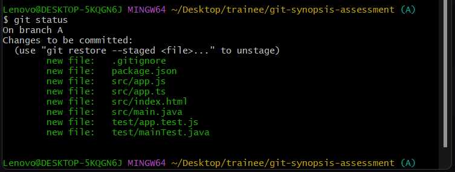
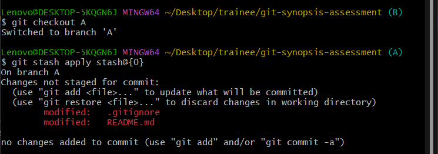
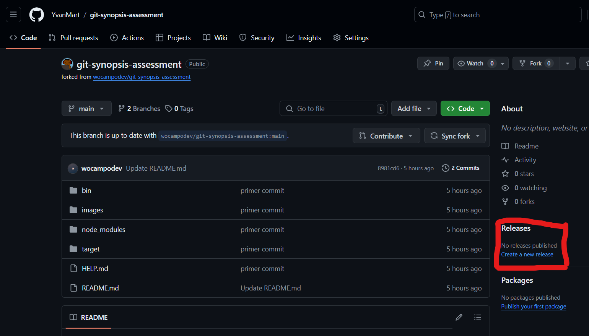
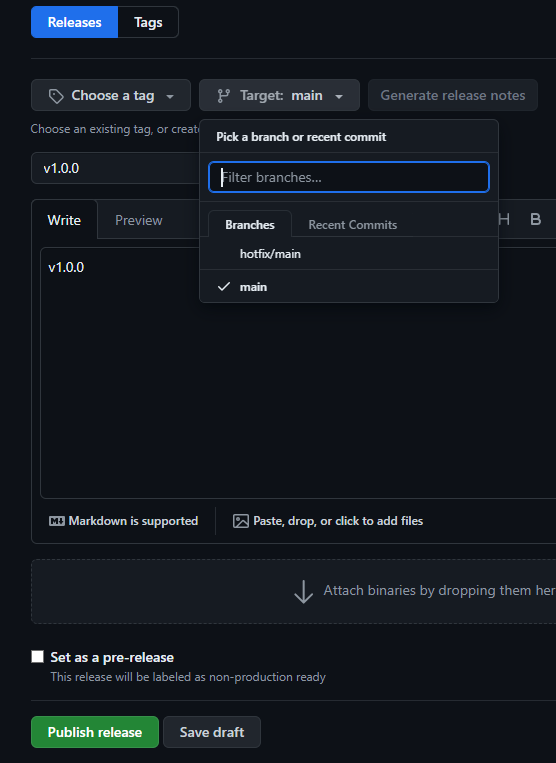
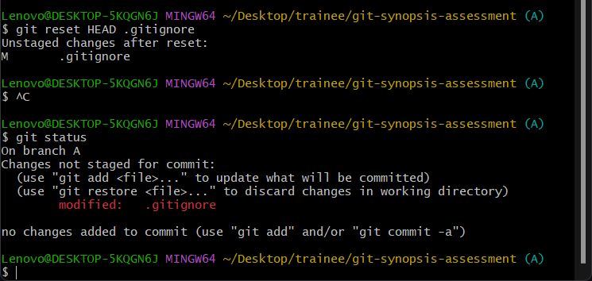

# Solución

## Actividades principales

1. Genere una nueva rama A en base a main y agregar los ficheros que considere necesarios. (.js | .ts | .java | .cs | .html | etc).

    - Crear y cambiar a una nueva rama 'A'

        

    - Agregamos nuevos ficheros.
    
        

    - Agregamos los cambios al staging area y realizamos un commit

        

        

    
2. Restringir del historial de cambios a las carpetas **/bin** **/node_modules** y **/target**.

    - Editamos el archivo .gitignore, añadiendo las excepciones.

        

        

    - Realizamos un commit con los cambios.

        

3. Generar 2 carpetas cualquiera sin contenido que sean incluidas en el historial de cambios.

    - Creamos dos carpetas vacías 'folderex1' y 'folderex2'.

        

    - Nos aseguramos que Git (.gitkeep) las incluya en el historial de cambios.

        

4. Generar **otra rama B** para realizar nuevas modificaciones y luego integrar estos en la **rama A**.

    - Creamos la rama B.
    
        

    - Realizamos modificaciones en los ficheros.
    
        

    - Realizamos un commit de los cambios en la rama B
    
        

    - Cambiamos a la rama A e integramos los cambios de la rama B.
    
        

5. Integrar **SOLO** el commit con nombre *"FIX: issue 2"* de la rama **hotfix/main** en la **rama A**.

    - Nos movemos a la rama hotfix/main.

        

    - Identificamos el hash del commit "FIX: issue 2".
        
        

    - Integramos solo ese commit en la rama A.

        

        *Nota: Dado que el archivo fue eliminado, debemos resolver el conflicto decidiendo si mantenemos el archivo o lo eliminamos, en mi caso lo restauramos.*

        

6. Ejemplifique el uso de git para la modificación de ficheros en la rama A y en la rama B simultaneamente **sin generar commits en el historial de cambios**.

    - Modificamos ficheros en la rama A.

        

    - Guardamos los cambios de la rama A usando git stash.

        

    - Cambiamos a la rama B y modificamos otros ficheros.

        
    
    - Aplicamos los cambios de la rama A en la rama B

        
    
    - Guardarmos los cambios en un stash temporalmente

        

    - Cambiamos a la rama A y aplicamos los cambios combinados

        

7. Ejemplifique el uso de git para la generación y publicación de un **nuevo release (versión)** de su código.

    - Vamos a la pestaña Releases en GitHub.
    - Hacemos clic en Create a new release.

        

    - Asignamos un nombre a la versión y seleccionamos la rama a usar.
    - Añadimos una descripción y publicamos la release.

        

## Extras

1. Ejemplique el uso de git para devolver un fichero del **staging area** al estado anterior.

    - Primero realizamos una modificacion a un fichero, lo añadimos al *staging area* verificamos que se añadio usando `git status`.

        

    - Usando `git reset` devolver el archivo del staging area al estado anterior y comprobamos usando `git status`

        

2. Ejemplifique el uso de git para regresar en el tiempo hacia un **commit anterior en la rama A** de su repositorio remoto propio.

    -Para regresar a un commit anterior

- Investigar sobre **git reset**
    - `git reset` es un comando de Git que se utiliza para revertir cambios en el repositorio de trabajo.

    Formas de utilizar git reset
    - `git reset sin opciones`: Revierte TODOS los cambios realizados en el repositorio de trabajo desde el último commit.
    - `git reset <archivo>`: Revierte los cambios realizados en un archivo específico.
    - `git reset --hard`: Revierte todos los cambios realizados en el repositorio de trabajo y elimina cualquier cambio en el *staging area*.
    - `git reset --soft`: Revierte los cambios realizados en el *staging area*, pero no afecta a los archivos en el repositorio de trabajo.
    - `git reset --mixed`: Revierte los cambios realizados en el *staging area* y en los archivos en el repositorio de trabajo.
